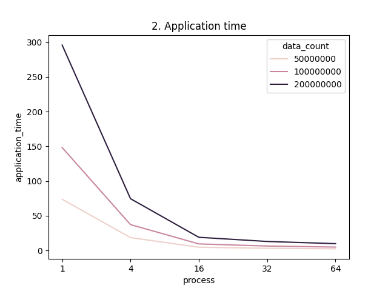

# mpi-histo
A program developed using MPI for distributed computation of Histogram for large data and their performance anaysis on multi-core systems. The program is written in C and uses SPMD architecture to fork processes and compute histogram. There are two implementations:
<pre><code>histo.c => Using point to point communication MPI_Send, MPI_Recv to communicate between processes
histo.c => Using collective communication MPI_Broadcast, MPI_Scatter and MPI_Gather to communicate between processes</code></pre>
# Compilation and Execution
The programs are compiled using mpicc and run using mpiexec. The compilation and execution instructions are shown below:
<br/>
> Compilation:  ```mpicc mpi_histo.c  -o <executable_name>```

> Execution: ```mpiexec -n <no_processes> <executable_name> <bin_count> <data_min> <data_max> <data_count>```

Taken from command line arguments:
<pre>
no_processes  : Total number of processes to start.
bin_count     : Total number of bin_count for histogram.
data_min      : Minimum value for data
data_max      : Maximum value for data
data_count    : Number of random data points to generate.
</pre>
> By default this program creates <data_count> number of random data points between data_min and data_max and computes the histogram for <bin_count> 
> number of data items. The code can be modified according to scenarios or make it read a large data file and compute the histogram on real data. 

Example:<br/> 
Compilation: ```mpicc mpi_histo.c  -o mpi_histo```<br/>
Execution: ```mpiexec -n 2 ./mpi_histo 10 1 100 10```

# Performance Analysis
The histogram compuation was done for ```50000000```, ```100000000``` and ```200000000``` data points using 1 to 64 cores on a 4 node CHPC kingspeak cluster.
The results obtained are described here.
 ## 1. Timing Performance
<pre>

</pre>
> Total Execution time: It is the time taken by the program to complete the execution.<br/>
> Application Time: This includes the time taken by the process to create and distribute data and compute histogram. <br/>
> Histogram time: This is the time taken by one process to compute histogram on scattered data.

From the figures, for a serial program (process = 1) as the number of data elements increases the time taken to compute the histogram also increases. 
But as the number of processes is increased the total time to compute the histogram decreases as the work is divided among the processes. 
We can also see that the total time and the application time is greater than the time taken to compute the histogram. 
The reason behind this is, total execution time and application time also includes the time taken to scatter the data among the processes whereas, histogram time only accounts the maximum time taken by a process to compute the histogram. 


## 2. Speedup Analysis
<pre>

</pre>

The speedup of a parallel program is given as: S(n,p) = Tserial(n) / Tparallel(n, p). From the figures we can see that the speedup for total time of the program is less than application and histogram computation time for a program. 
Similar to timing reports, total execution time of a program includes the time taken by process 0 to populate and scatter the data. But in the case of histogram time the speedup is drastically increased and is nearly a linear speedup.

> Note: As the number of processes increases it adds a communication overhead on the system thus reducing the execution time.

## Timing data obtained for my execution obtained from 4 Node (kingspeak) CHPC cluster:
<table><tbody><tr class="c3"><td class="c10" colspan="1" rowspan="1"><p class="c7"><span class="c8">Processes</span></p></td><td class="c12" colspan="1" rowspan="1"><p class="c7"><span class="c8">Total Time</span></p></td><td class="c9" colspan="1" rowspan="1"><p class="c7"><span class="c8">Application Time</span></p></td><td class="c13" colspan="1" rowspan="1"><p class="c7"><span class="c8">Histogram Time</span></p></td><td class="c11" colspan="1" rowspan="1"><p class="c7"><span class="c8">Data Count</span></p></td></tr><tr class="c1"><td class="c10" colspan="1" rowspan="1"><p class="c6"><span class="c8">1</span></p></td><td class="c12" colspan="1" rowspan="1"><p class="c6"><span class="c8">74.423788</span></p></td><td class="c9" colspan="1" rowspan="1"><p class="c6"><span class="c8">73.756131</span></p></td><td class="c13" colspan="1" rowspan="1"><p class="c6"><span class="c8">73.569383</span></p></td><td class="c11" colspan="1" rowspan="1"><p class="c6"><span class="c8">50000000</span></p></td></tr><tr class="c1"><td class="c10" colspan="1" rowspan="1"><p class="c6"><span class="c8">4</span></p></td><td class="c12" colspan="1" rowspan="1"><p class="c6"><span class="c8">19.308111</span></p></td><td class="c9" colspan="1" rowspan="1"><p class="c6"><span class="c8">18.636843</span></p></td><td class="c13" colspan="1" rowspan="1"><p class="c6"><span class="c8">18.439549</span></p></td><td class="c11" colspan="1" rowspan="1"><p class="c6"><span class="c8">50000000</span></p></td></tr><tr class="c1"><td class="c10" colspan="1" rowspan="1"><p class="c6"><span class="c8">16</span></p></td><td class="c12" colspan="1" rowspan="1"><p class="c6"><span class="c8">5.504118</span></p></td><td class="c9" colspan="1" rowspan="1"><p class="c6"><span class="c8">4.754371</span></p></td><td class="c13" colspan="1" rowspan="1"><p class="c6"><span class="c8">4.615857</span></p></td><td class="c11" colspan="1" rowspan="1"><p class="c6"><span class="c8">50000000</span></p></td></tr><tr class="c1"><td class="c10" colspan="1" rowspan="1"><p class="c6"><span class="c8">32</span></p></td><td class="c12" colspan="1" rowspan="1"><p class="c6"><span class="c8">3.926105</span></p></td><td class="c9" colspan="1" rowspan="1"><p class="c6"><span class="c8">3.230799</span></p></td><td class="c13" colspan="1" rowspan="1"><p class="c6"><span class="c8">2.302202</span></p></td><td class="c11" colspan="1" rowspan="1"><p class="c6"><span class="c8">50000000</span></p></td></tr><tr class="c1"><td class="c10" colspan="1" rowspan="1"><p class="c6"><span class="c8">64</span></p></td><td class="c12" colspan="1" rowspan="1"><p class="c6"><span class="c8">3.436093</span></p></td><td class="c9" colspan="1" rowspan="1"><p class="c6"><span class="c8">2.481364</span></p></td><td class="c13" colspan="1" rowspan="1"><p class="c6"><span class="c8">1.150515</span></p></td><td class="c11" colspan="1" rowspan="1"><p class="c6"><span class="c8">50000000</span></p></td></tr><tr class="c1"><td class="c10" colspan="1" rowspan="1"><p class="c6"><span class="c8">1</span></p></td><td class="c12" colspan="1" rowspan="1"><p class="c6"><span class="c8">149.605372</span></p></td><td class="c9" colspan="1" rowspan="1"><p class="c6"><span class="c8">148.257896</span></p></td><td class="c13" colspan="1" rowspan="1"><p class="c6"><span class="c8">147.896947</span></p></td><td class="c11" colspan="1" rowspan="1"><p class="c6"><span class="c8">100000000</span></p></td></tr><tr class="c1"><td class="c10" colspan="1" rowspan="1"><p class="c6"><span class="c8">4</span></p></td><td class="c12" colspan="1" rowspan="1"><p class="c6"><span class="c8">38.644788</span></p></td><td class="c9" colspan="1" rowspan="1"><p class="c6"><span class="c8">37.317932</span></p></td><td class="c13" colspan="1" rowspan="1"><p class="c6"><span class="c8">36.934477</span></p></td><td class="c11" colspan="1" rowspan="1"><p class="c6"><span class="c8">100000000</span></p></td></tr><tr class="c1"><td class="c10" colspan="1" rowspan="1"><p class="c6"><span class="c8">16</span></p></td><td class="c12" colspan="1" rowspan="1"><p class="c6"><span class="c8">10.867961</span></p></td><td class="c9" colspan="1" rowspan="1"><p class="c6"><span class="c8">9.537738</span></p></td><td class="c13" colspan="1" rowspan="1"><p class="c6"><span class="c8">9.233756</span></p></td><td class="c11" colspan="1" rowspan="1"><p class="c6"><span class="c8">100000000</span></p></td></tr><tr class="c1"><td class="c10" colspan="1" rowspan="1"><p class="c6"><span class="c8">32</span></p></td><td class="c12" colspan="1" rowspan="1"><p class="c6"><span class="c8">7.780161</span></p></td><td class="c9" colspan="1" rowspan="1"><p class="c6"><span class="c8">6.458228</span></p></td><td class="c13" colspan="1" rowspan="1"><p class="c6"><span class="c8">4.580765</span></p></td><td class="c11" colspan="1" rowspan="1"><p class="c6"><span class="c8">100000000</span></p></td></tr><tr class="c1"><td class="c10" colspan="1" rowspan="1"><p class="c6"><span class="c8">64</span></p></td><td class="c12" colspan="1" rowspan="1"><p class="c6"><span class="c8">6.301298</span></p></td><td class="c9" colspan="1" rowspan="1"><p class="c6"><span class="c8">4.971914</span></p></td><td class="c13" colspan="1" rowspan="1"><p class="c6"><span class="c8">2.294652</span></p></td><td class="c11" colspan="1" rowspan="1"><p class="c6"><span class="c8">100000000</span></p></td></tr><tr class="c1"><td class="c10" colspan="1" rowspan="1"><p class="c6"><span class="c8">1</span></p></td><td class="c12" colspan="1" rowspan="1"><p class="c6"><span class="c8">298.528679</span></p></td><td class="c9" colspan="1" rowspan="1"><p class="c6"><span class="c8">295.804794</span></p></td><td class="c13" colspan="1" rowspan="1"><p class="c6"><span class="c8">294.842392</span></p></td><td class="c11" colspan="1" rowspan="1"><p class="c6"><span class="c8">200000000</span></p></td></tr><tr class="c1"><td class="c10" colspan="1" rowspan="1"><p class="c6"><span class="c8">4</span></p></td><td class="c12" colspan="1" rowspan="1"><p class="c6"><span class="c8">77.303529</span></p></td><td class="c9" colspan="1" rowspan="1"><p class="c6"><span class="c8">74.629462</span></p></td><td class="c13" colspan="1" rowspan="1"><p class="c6"><span class="c8">73.983486</span></p></td><td class="c11" colspan="1" rowspan="1"><p class="c6"><span class="c8">200000000</span></p></td></tr><tr class="c1"><td class="c10" colspan="1" rowspan="1"><p class="c6"><span class="c8">16</span></p></td><td class="c12" colspan="1" rowspan="1"><p class="c6"><span class="c8">21.717287</span></p></td><td class="c9" colspan="1" rowspan="1"><p class="c6"><span class="c8">19.049401</span></p></td><td class="c13" colspan="1" rowspan="1"><p class="c6"><span class="c8">18.434128</span></p></td><td class="c11" colspan="1" rowspan="1"><p class="c6"><span class="c8">200000000</span></p></td></tr><tr class="c1"><td class="c10" colspan="1" rowspan="1"><p class="c6"><span class="c8">32</span></p></td><td class="c12" colspan="1" rowspan="1"><p class="c6"><span class="c8">15.902424</span></p></td><td class="c9" colspan="1" rowspan="1"><p class="c6"><span class="c8">13.048625</span></p></td><td class="c13" colspan="1" rowspan="1"><p class="c6"><span class="c8">9.19137</span></p></td><td class="c11" colspan="1" rowspan="1"><p class="c6"><span class="c8">200000000</span></p></td></tr><tr class="c1"><td class="c10" colspan="1" rowspan="1"><p class="c6"><span class="c8">64</span></p></td><td class="c12" colspan="1" rowspan="1"><p class="c6"><span class="c8">12.687857</span></p></td><td class="c9" colspan="1" rowspan="1"><p class="c6"><span class="c8">9.89958</span></p></td><td class="c13" colspan="1" rowspan="1"><p class="c6"><span class="c8">4.63593</span></p></td><td class="c11" colspan="1" rowspan="1"><p class="c6"><span class="c8">200000000</span></p></td></tr></tbody></table>


